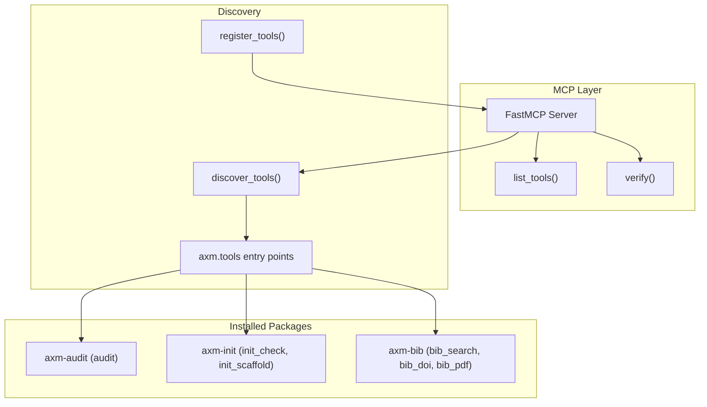

# Architecture

## Overview

`axm-mcp` is a thin MCP shell with zero imports from AXM core. It discovers tools at runtime via Python entry points and exposes them over the Model Context Protocol.

## Modules

| Module | Key Symbols | Purpose |
|---|---|---|
| `mcp_app.py` | `mcp`, `_verify_tool()`, `main()` | FastMCP server instance + verify tool registration |
| `discovery.py` | `discover_tools()`, `register_tools()`, `ToolLike` | Entry point scanning + MCP registration |
| `verify.py` | `verify_project()` | Orchestrate audit + init check + AST enrichment |

## Design Decisions

| Decision | Rationale |
|---|---|
| Zero imports from `axm` core | Fully decoupled — `axm-mcp` works with any combination of installed packages |
| `ToolLike` Protocol | Duck typing via `Protocol` — no class inheritance needed |
| Entry points for discovery | Standard Python mechanism, no config files needed |
| `verify` as meta-tool | Single call replaces 3 separate tool invocations |
| AST enrichment of failures | Adds blast-radius context to help agents prioritize fixes |

## Tool Lifecycle

1. **Startup**: `discover_tools()` scans `axm.tools` entry points
2. **Registration**: `register_tools()` wraps each tool as an MCP callable
3. **Execution**: MCP client calls tool → wrapper delegates to `tool.execute(**kwargs)` → returns `ToolResult`
4. **Verify**: `verify_project()` chains audit → init_check → AST enrichment
