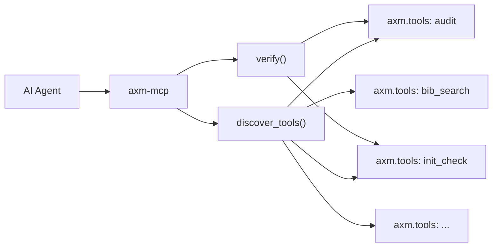

---
hide:
  - navigation
  - toc
---

# axm-mcp

<p align="center">
  <strong>MCP server for the axm-protocols ecosystem.</strong>
</p>

<p align="center">
  <a href="https://github.com/axm-protocols/axm-mcp/actions/workflows/ci.yml"></a>
  <a href="https://axm-protocols.github.io/axm-init/explanation/check-grades/"></a>
  <a href="https://axm-protocols.github.io/axm-audit/"></a>
  <a href="https://coveralls.io/github/axm-protocols/axm-mcp?branch=main"></a>
  <a href="https://pypi.org/project/axm-mcp/"></a>
  
  
</p>

---

## What is axm-mcp?

`axm-mcp` is the Model Context Protocol (MCP) server that bridges AXM tools to AI agents. It auto-discovers all `axm.tools` entry points from installed packages and exposes them as MCP-callable tools — no configuration needed.

## How it Works



## Quick Example

```bash
# Start the MCP server
axm-mcp
```

All installed AXM tools are immediately available to any MCP client.

---

<div style="text-align: center; margin: 2rem 0;">
  <a href="tutorials/quickstart/" class="md-button md-button--primary">Get Started →</a>
  <a href="reference/cli/" class="md-button">CLI Reference</a>
</div>
